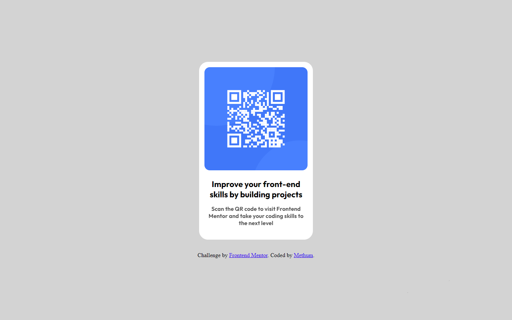

# Frontend Mentor - QR code component solution

This is a solution to the [QR code component challenge on Frontend Mentor](https://www.frontendmentor.io/challenges/qr-code-component-iux_sIO_H). Frontend Mentor challenges help you improve your coding skills by building realistic projects.

## Overview

### Screenshot

### Links

- Solution URL: [Add solution URL here](https://your-solution-url.com)
- Live Site URL: [Add live site URL here](https://your-live-site-url.com)

## My process

### Built with

- HTML
- CSS
- Google fonts

##Features

-Responsive design that adapts to different screen sizes and devices.
-Eye-catching QR code image to attract user attention.
-Engaging description to promote skill improvement and participation in coding projects.

### What I learned

This project was a great opportunity for me to recall and reinforce my knowledge of HTML and CSS. Here are some key takeaways:

- Efficiently structuring content with HTML to create a responsive design.
- Using CSS for styling, including custom properties, flexbox, and grid layout.
- Incorporating external fonts for a visually appealing text layout.

### Continued development

While working on this project, I found areas where I can continue to improve:

- Exploring more advanced CSS features and techniques.
- Enhancing my understanding of responsive design principles.
- Experimenting with different font choices and styling options.

## Author

- Methum Menthusa
- Frontend Mentor -(https://www.frontendmentor.io/profile/The-OG-Methum)
- GitHub - (https://github.com/The-OG-Methum)

## Acknowledgments

I completed this challenge independently, recalling my HTML and CSS skills. Special thanks to Frontend Mentor for providing such realistic projects for practice.
